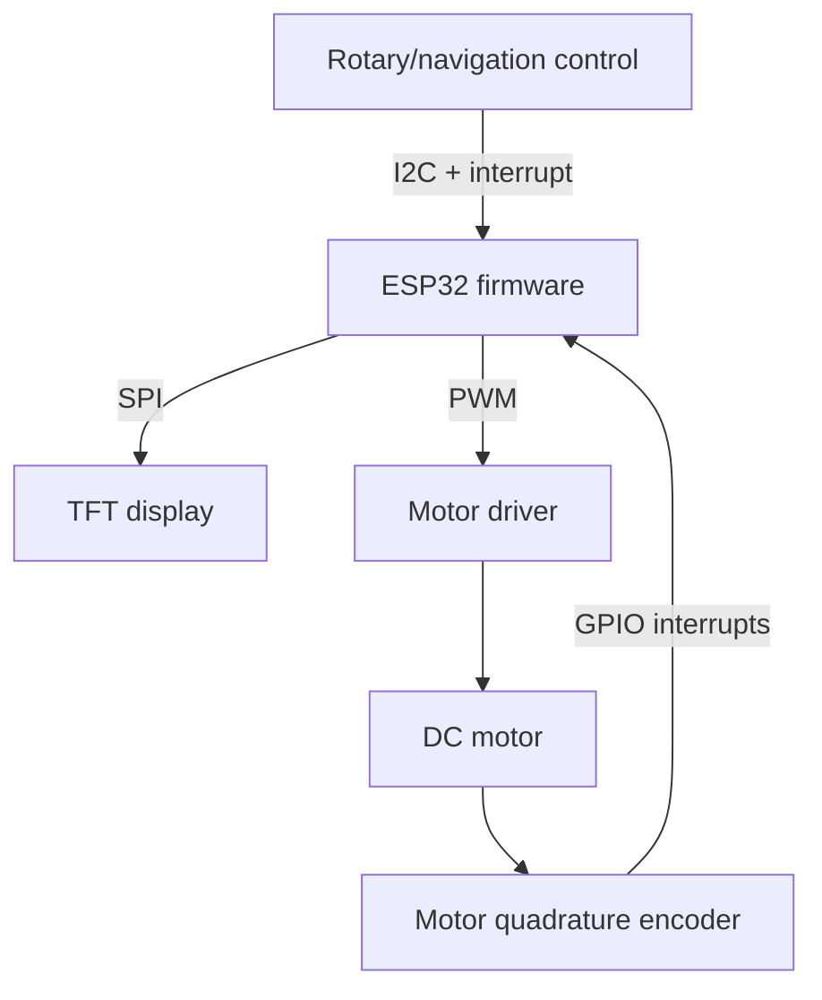

# ESP32 Closed-Loop Motor Controller

An ESP32-based DC motor speed controller built as a working breadboard prototype. The system reads motor speed from a quadrature encoder, regulates RPM with a tunable PID controller, and presents live operating data on a color TFT display. A rotary/navigation control provides local setpoint and tuning input.

The project was built to explore embedded control systems, real-time firmware, motor feedback, and hardware/user-interface integration using ESP-IDF and FreeRTOS.

> **Project status:** Functional breadboard prototype. The firmware source has been added to the repository, and the ESP32, TFT display, motor and wheel encoder, rotary/navigation input, 9 V input, and motor-driver board are assembled and operating together. Supporting hardware documentation and test results are being added incrementally.

## Features

- Closed-loop DC motor speed control
- Quadrature encoder speed feedback
- Adjustable RPM command in 10 RPM increments
- Runtime adjustment of proportional, integral, and derivative gains
- Live display of measured RPM, commanded RPM, PWM output, and error
- Step-response measurements including rise time, settling time, and overshoot/undershoot
- On-screen plot of measured and commanded RPM
- Interrupt-driven encoder inputs
- Separate FreeRTOS tasks for control, user input, and display updates
- Custom low-level SPI display driver and bitmap font rendering
- I2C communication with the user-input controller

## Hardware

The current breadboard assembly contains:

| Component | Purpose |
| --- | --- |
| ESP32 development board | Main controller and application processor |
| 160 × 80 ST7735 color TFT | Status, control data, PID settings, and response plot |
| DC motor with quadrature encoder | Controlled plant and speed feedback |
| Motor-driver module | Interfaces the ESP32 PWM signal to the motor |
| Adafruit seesaw ANO rotary-navigation module | RPM entry, screen navigation, and PID adjustment |
| 9 V input supply | Motor/controller power input |
| Breadboard and jumper wiring | Prototype interconnect |

The exact ESP32 development board and motor-driver part number, along with the power-distribution schematic, still need to be added.

## Connections

### TFT display — SPI2

| Signal | ESP32 GPIO |
| --- | ---: |
| MOSI | 23 |
| SCLK | 18 |
| Chip select | 25 |
| Data/command | 33 |
| Reset | 26 |
| Backlight | 27 |

The display uses SPI mode 0 at 10 MHz with 16-bit color. The firmware drives the ST7735 directly rather than relying on a graphics library. A 25-pixel row offset accounts for the active area of the 160 × 80 panel.

### ANO rotary-navigation module — I2C

| Signal | ESP32 GPIO / value |
| --- | ---: |
| SDA | 21 |
| SCL | 22 |
| Interrupt | 34 |
| I2C address | `0x49` |
| Bus speed | 100 kHz |

The seesaw GPIO inputs are active-low and use internal pull-ups. The rotary position and five navigation switches are read through the seesaw register interface.

### Motor and feedback

| Signal | ESP32 GPIO |
| --- | ---: |
| Motor-driver PWM | 19 |
| Quadrature encoder A | 36 |
| Quadrature encoder B | 39 |

GPIO 36 and GPIO 39 are input-only pins on the ESP32. The current firmware disables the ESP32's internal pulls on these signals, so the encoder outputs must already be driven to valid logic levels or use suitable external biasing.

## System Architecture



The firmware operates as a feedback loop:

1. Encoder interrupts maintain a signed motor-position count.
2. The control task samples the count at a fixed interval and converts the change in counts to RPM.
3. A first-order filter smooths the measured speed.
4. The PID controller compares measured RPM with commanded RPM.
5. The controller output adjusts the PWM duty command sent to the motor driver.
6. The display task reports live values and plots the response.

## User Interface

The interface contains three screens.

### Main screen

Displays:

- Measured RPM
- Pending RPM setting
- Active RPM command
- PWM command
- Instantaneous speed error
- Overshoot or undershoot
- Rise time
- Settling time
- Command direction and steady-state status

Rotate the input encoder to change the pending RPM command. Press **Select** to apply it. The command is constrained between zero and the configured maximum motor speed.

### Plot screen

Plots measured RPM and commanded RPM from a circular waveform buffer, providing a quick visual check of the motor's response to setpoint changes.

### PID screen

Allows live adjustment of the controller gains:

- `Kp` in increments of 0.10
- `Ki` in increments of 0.01
- `Kd` in increments of 0.01

Use **Up/Down** to select a gain and rotate the encoder to change its value. **Left/Right** changes screens throughout the interface.

## Control Implementation

Motor speed is calculated from the change in encoder count:

```text
RPM = (delta encoder ticks × 60) / (ticks per revolution × sample period)
```

The current firmware is configured for 1,200 encoder ticks per revolution and a 20 ms control period. A first-order exponential filter with an alpha value of 0.4 is applied before the speed is passed to the controller.

The controller calculates proportional, integral, and derivative contributions from the speed error. Its output is applied as an incremental correction to the existing PWM command, then clamped to the configured valid duty-cycle range.

For a new speed command, the firmware also evaluates the transient response:

- **Rise time:** time required to reach 90% of the requested speed change
- **Settling time:** time until the measured speed remains within ±3% of the target for 100 control-loop samples
- **Overshoot/undershoot:** largest excursion beyond the target, normalized to the requested speed change
- **Steady-state error:** remaining RPM error when settling is detected

## Firmware Organization

| Source file | Responsibility |
| --- | --- |
| `main.c` | System state, peripheral initialization, and task creation |
| `app_tasks.c` | FreeRTOS control, input, and display task loops |
| `motor.c` | PWM output and quadrature-encoder interrupt handling |
| `calc.c` | RPM calculation, filtering, and PID calculations |
| `input.c` | I2C input module, buttons, rotary encoder, and interrupt handling |
| `i2cmanager.c` | Low-level I2C transactions and startup bus scan |
| `display_mgr.c` | SPI bus and TFT-controller initialization |
| `display.c` | Drawing primitives, bitmap font, and boot graphics |
| `ui.c` | Screen navigation, input behavior, display rendering, and plot buffer |

The application starts the following FreeRTOS tasks:

| Task | Priority | Role |
| --- | ---: | --- |
| `controlTask` | 5 | Samples speed, runs the controller, records response metrics, and updates PWM |
| `inputTask` | 3 | Polls button state and passes rotary/button events to the UI |
| `displayTask` | 2 | Performs full redraws and incremental display updates |

This priority order keeps the motor-control loop ahead of input handling and comparatively slow display traffic.

### Timing and limits

| Setting | Current value |
| --- | ---: |
| Control-loop period | 20 ms / 50 Hz |
| Input-loop period | 10 ms / 100 Hz |
| Display-loop period | 100 ms / 10 Hz |
| Encoder resolution used by RPM calculation | 1,200 ticks/revolution |
| Maximum commanded speed | 250 RPM |
| PWM frequency | 20 kHz |
| PWM resolution | 10 bit |
| PWM command range | 0–1,023 |
| Waveform buffer | 160 samples |

The initial gains loaded at startup are `Kp = 1.00`, `Ki = 0.01`, and `Kd = 0.20`.

## Building

The firmware is written for the Espressif IoT Development Framework (ESP-IDF).

From the ESP-IDF project directory:

```bash
idf.py set-target esp32
idf.py build
idf.py -p PORT flash monitor
```

Replace `PORT` with the ESP32 serial port, such as `COM5` on Windows or `/dev/ttyUSB0` on Linux.

## Repository Status and Roadmap

### Currently included

- ESP-IDF firmware source and header files
- Project build and configuration files
- Overview of the hardware, firmware, user interface, and control loop
- GPIO assignments and communication settings
- Firmware file and FreeRTOS task descriptions

### Planned next

- Breadboard prototype photo
- Bill of materials with exact part numbers and manufacturer links
- Excel workbook used to design and encode the custom bitmap typeface
- Short README explaining the typeface-generation workflow

### Planned later

- Demonstration video showing setpoint entry, motor response, and UI operation
- Complete electrical schematic and power-distribution documentation
- Detailed software-architecture diagram
- Measured commanded-versus-actual RPM results
- Step-response plots and final tuned PID gains
- Controller design and tuning explanation
- Safe power-up and operating instructions

The repository is intentionally being documented in stages so its commit history reflects the project's continued testing, measurement, and refinement.

## Potential Firmware Improvements

- Add integral anti-windup and defined controller-reset behavior
- Verify time scaling in the integral term
- Move encoder resolution and timing constants into a centralized configuration
- Protect shared state exchanged between tasks
- Improve circular-buffer wrap handling in the plot screen
- Add motor stop, fault, and startup safety states
- Store PID gains and user settings in nonvolatile memory
- Add serial logging or CSV capture for controller tuning
- Separate board-specific pin definitions from application logic

## What This Project Demonstrates

- ESP32 peripheral configuration using ESP-IDF
- Real-time task design with FreeRTOS
- Closed-loop feedback and PID control
- Quadrature encoder decoding with GPIO interrupts
- PWM motor control
- SPI and I2C device communication
- Embedded graphics and local user-interface development
- Experimental measurement of control-system response

## License

No license has been selected yet. Add a license before inviting reuse or contributions.
